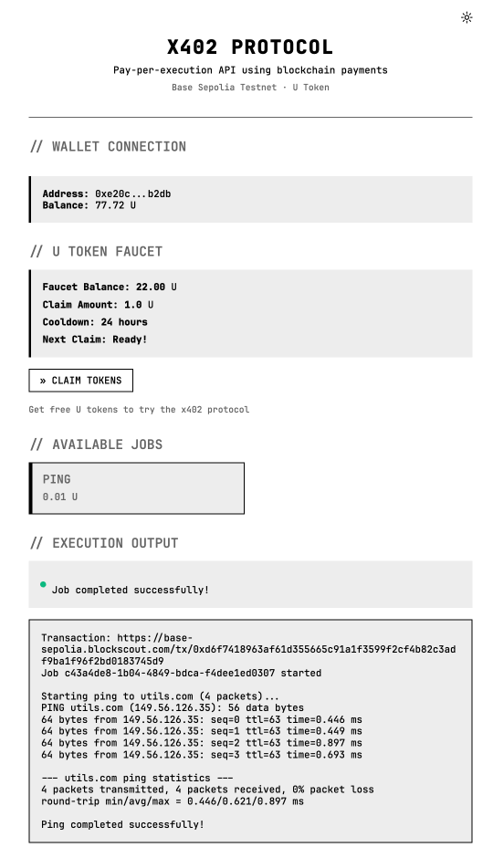

# x402 Utils - Pay-per-Execution with X-Chain Token

A blockchain-based pay-per-execution service implementing the **x402 protocol** (HTTP 402 Payment Required). Users pay with U tokens (or signature-based payment) on Base Sepolia to execute jobs, with results streamed back in real-time.

**Powered by**: [LayerZero](https://layerzero.network/) · [Privy](https://privy.io/) · [Coinbase Base](https://base.org/) · [x402](https://x402.org/)

**Live demo at**: https://x402.utils.com/

**Status**: ✅ Production-ready PoC · All tests passing · Multiple frontends · Python agent

## 🚀 Built With Industry-Leading Technologies

This project showcases the integration of three powerful blockchain infrastructure providers:

### 🔗 [LayerZero](https://layerzero.network/)
**Omnichain Interoperability Protocol** - Powers the U token with seamless cross-chain transfers between Ethereum and Base. No wrapped tokens, no bridges to trust—just native cross-chain fungibility.

### 🔐 [Privy](https://privy.io/)
**Embedded Wallet Infrastructure** - Provides frictionless web3 onboarding with social logins, embedded wallets, and delegated transaction signing. Users can interact with blockchain apps without managing private keys.

### 💳 [Coinbase](https://www.coinbase.com/)
**Enterprise Blockchain Platform** - Leverages Base L2 for high-performance, low-cost transactions. Base provides the scalability needed for microtransactions in the x402 protocol.

**Why This Stack?**
- **LayerZero**: Cross-chain liquidity without fragmentation
- **Privy**: Web2-level UX for web3 applications
- **Base (Coinbase)**: Production-ready L2 with institutional backing

---

## 📸 See It In Action

<p align="center">
  
  <br>
  <em>x402 web interface executing a ping job with real-time streaming results</em>
</p>

---

## 🎯 Overview

**Payment Flows**:
1. **Traditional**: User → 402 Response → ERC20 Transfer → Payment Verified → Job Executes → Results Stream
2. **x402 Signature**: User → Sign EIP-712 → X-PAYMENT Header → Instant Authorization → Job Executes → Results Stream

```
┌─────────────────┐     ┌──────────────────┐     ┌────────────────────┐
│  2 Frontends    │────▶│  FastAPI Backend │────▶│  Base Sepolia      │
│  + 1 Agent      │◀────│  (x402 Server)   │◀────│  Blockchain        │
└─────────────────┘     └──────────────────┘     └────────────────────┘
  • Vanilla JS            • Payment verify        • U Token (ERC20)
  • React + Privy         • EIP-712 sigs          • Payment tracking
  • Python Agent          • SSE streaming         • Smart contracts
```

## 💰 U Token - Cross-Chain Payment Token

The x402 protocol uses **U Token**, a custom ERC20 token built with LayerZero's Omnichain Fungible Token (OFT) standard. This enables seamless cross-chain transfers between networks.

### Why Cross-Chain?

- **Ethereum (Sepolia)**: Primary network for liquidity and token minting
- **Base (Sepolia)**: Optimized for high-performance, low-cost transactions
- **LayerZero Bridge**: Automatic token bridging between chains in ~5-10 minutes

### Getting Test Tokens

A **public testnet faucet** is available for anyone to experiment with the x402 protocol:

- **Faucet Address**: `0x63b7eF0778143E23f7320ab5bB77344aE66e7a57` (Base Sepolia)
- **Distribution**: 1 U token per address per day
- **Purpose**: Free tokens for testing and development
- **Explorer**: [View on Blockscout](https://base-sepolia.blockscout.com/address/0x63b7eF0778143E23f7320ab5bB77344aE66e7a57)

**U Token Addresses**:
- Sepolia: `0x3edEa36d049fFeF9Ac3fC3646227ca81C9A87118`
- Base Sepolia: `0x7143401013282067926d25e316f055fF3bc6c3FD`

For more details on the U token and faucet management, see the `u-layerzero/` and `u-faucet/` directories.

## 🚀 Quick Start (1 Minute)

### Fastest Way - Use the Start Script

```bash
./start.sh
```

This automatically starts:
- ✅ **Backend** on http://localhost:8989
- ✅ **Frontend-JS** on http://localhost:3000 (Vanilla JS + MetaMask)
- ✅ **Frontend-Privy** on http://localhost:3001 (React + Privy + x402)

### Manual Setup

1. **Configure backend:**
   ```bash
   cd x402-backend
   cp .env.example .env
   # Edit .env: RECIPIENT_ADDRESS=0xYourWalletAddress
   ```

2. **Run backend:**
   ```bash
   cd x402-backend
   python -m venv venv
   source venv/bin/activate  # Windows: venv\Scripts\activate
   pip install -r requirements.txt
   python main.py
   ```

3. **Choose your frontend:**

   **Option A: Vanilla JS (MetaMask/Coinbase Wallet)**
   ```bash
   cd x402-js
   python -m http.server 3000
   # Visit: http://localhost:3000
   ```

   **Option B: React + Privy (Recommended - Full x402)**
   ```bash
   cd x402-privy
   npm install
   npm run dev
   # Visit: http://localhost:3001
   ```

4. **Or run the Python agent:**
   ```bash
   cd x402-agent
   pip install -r requirements.txt
   python x402_agent.py  # Pings google.com every 3 minutes
   ```

## 📊 Frontend Comparison

| Feature | Frontend-JS (3000) | Frontend-Privy (3001) ⭐ | Agent |
|---------|-------------------|----------------------|-------|
| **Tech** | Vanilla JS | React + Privy | Python |
| **Wallet** | MetaMask/Coinbase | Privy Embedded | Generated |
| **Payment** | ERC20 Transfer | x402 + Traditional | x402 Signature |
| **Auto-Approve** | ❌ No | ✅ Yes (Delegation) | N/A |
| **x402 Protocol** | ❌ No | ✅ Full Support | ✅ Yes |
| **Best For** | Testing basics | Production use | Automation |
| **Setup** | None | `npm install` | `pip install` |

**Recommendation**: Use **Frontend-Privy (3001)** for full x402 features and best UX.

## 🏗️ Architecture

### Backend (FastAPI)
- **Dual payment support**: Traditional ERC20 transfers + x402 signature-based
- **EIP-712 verification**: Validates signed payment authorizations
- **Extensible job system**: Plugin-based registry for easy job type additions
- **Payment verification**: Monitors Base Sepolia for ERC20 Transfer events
- **Real-time streaming**: Server-Sent Events (SSE) for live output
- **Timeout management**: 5-minute configurable payment windows

### Frontend Options

**1. Frontend-JS (Port 3000)**
- Vanilla JavaScript with Web3.js
- MetaMask/Coinbase Wallet integration
- Traditional ERC20 payment flow
- Asta framework monospace UI
- No build process required

**2. Frontend-Privy (Port 3001)** ⭐ **Recommended**
- React + TypeScript with Vite
- Privy embedded wallet support
- Full x402 signature-based payment
- Delegated actions for auto-approve
- Dual payment method (x402 + traditional)
- Best developer experience

**3. Python Agent**
- Autonomous x402 client
- Periodic job execution
- EIP-712 signature creation
- No blockchain transaction needed
- Perfect for automation/monitoring

### Configuration
- **Network**: Base Sepolia (Chain ID: 84532)
- **RPC**: https://base-sepolia-rpc.publicnode.com
- **Token**: U at `0x7143401013282067926d25e316f055fF3bc6c3FD`
- **Pricing**: 0.01 U per ping
- **Payment timeout**: 300s (configurable via `PAYMENT_TIMEOUT` env var)

## API Endpoints

| Endpoint | Method | Description | Response |
|----------|--------|-------------|----------|
| `/` | GET | Health check | Service status |
| `/api/jobs` | GET | List available jobs | Jobs with pricing |
| `/api/jobs/request` | POST | Request job execution | **402** with payment details |
| `/api/jobs/verify-payment` | POST | Verify blockchain payment | Verification status |
| `/api/jobs/execute/{id}` | GET | Execute paid job | **SSE stream** |
| `/api/jobs/status/{id}` | GET | Check job status | Job state |

## Adding New Jobs

Create a job class inheriting from `Job`:

```python
# x402-backend/jobs/my_job.py
from decimal import Decimal
from .base import Job

class MyJob(Job):
    @classmethod
    def get_name(cls) -> str:
        return "my_job"

    @classmethod
    def get_price(cls) -> Decimal:
        return Decimal("0.05")

    def validate_params(self) -> tuple[bool, str]:
        # Validate self.params
        return True, ""

    async def execute(self) -> AsyncIterator[str]:
        yield "Starting...\n"
        # ... do work ...
        yield "Complete!\n"
```

Register in `x402-backend/jobs/registry.py`:
```python
from .my_job import MyJob

class JobRegistry:
    def _register_default_jobs(self):
        self.register(PingJob)
        self.register(MyJob)  # Add this
```

## Test Results

**Date**: 2025-11-22 · **Status**: ✅ All tests passed

- ✅ **Backend**: Server startup, Base Sepolia connection (no warnings)
- ✅ **API**: 7/7 endpoint tests passed
  - Health check, job listing, x402 flow, status, execution blocking
  - Input validation, error handling
- ✅ **Jobs**: Ping execution successful (8.8.8.8, 0% packet loss)
- ✅ **Protocol**: Complete x402 flow verified (request → 402 → verify → execute)
- ✅ **Code**: Python 3.12+ compatible, timezone-aware, lifespan context manager
- ✅ **Network**: Base Sepolia RPC connected, token contract accessible

**Environment**: Linux · Python 3.12.12 · FastAPI 0.109.0 · Web3.py 6.15.1


## Future Enhancements

- Job result caching and storage
- User accounts and history
- Webhook notifications
- Comprehensive test suite

## License

MIT License

## Resources

### Blockchain Infrastructure
- [LayerZero Docs](https://docs.layerzero.network/) - Omnichain interoperability protocol
- [LayerZero Scan](https://testnet.layerzeroscan.com/) - Track cross-chain transactions
- [Privy Docs](https://docs.privy.io/) - Embedded wallet infrastructure
- [Base Docs](https://docs.base.org/) - Coinbase L2 documentation
- [Base Sepolia Explorer](https://sepolia.basescan.org/) - Block explorer
- [Base Faucet](https://www.coinbase.com/faucets/base-ethereum-goerli-faucet) - Get testnet ETH

### Development Tools
- [FastAPI Docs](https://fastapi.tiangolo.com/) - Python web framework
- [Web3.py Docs](https://web3py.readthedocs.io/) - Python Ethereum library

## 💬 Feedback & Contributions

We'd love to hear from you! This project is open for ideas, suggestions, and contributions.

### Share Your Thoughts

- **💡 Ideas**: Have a feature idea or improvement suggestion? We want to hear it!
- **🐛 Issues**: Found a bug or something not working as expected? Let us know!
- **💬 Feedback**: General comments, questions, or thoughts about the x402 protocol? Reach out!
- **🤝 Contributions**: Pull requests are welcome! Whether it's code, documentation, or examples.


### Get In Touch 📧

- **Share Use Cases**. Show us what you've built or plan to build with the x402 protocol.

- **Open an issue** on this repository or submit a pull request. All contributions and feedback are appreciated! 🙏

---
